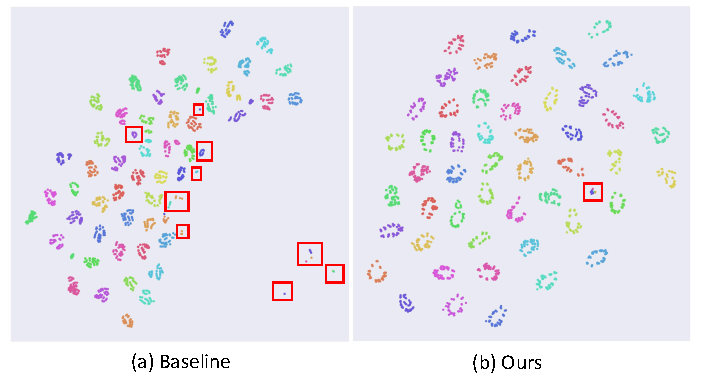
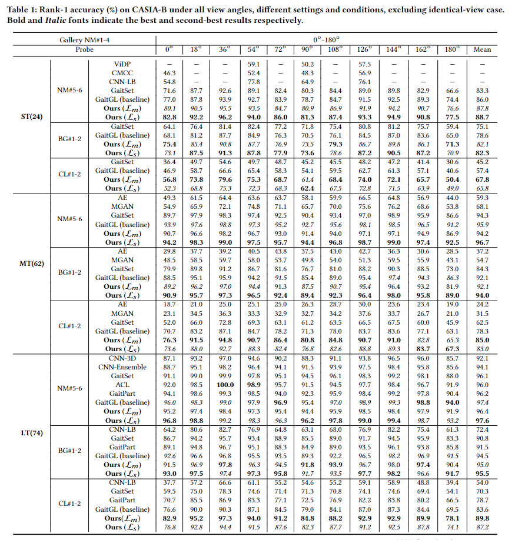

# Generalized Inter-class Loss for Gait Recognition (ACMMM22 paper)
Weichen Yu, Hongyuan Yu, Yan Huang, Liang Wang. "Generalized Inter-class Loss for Gait Recognition" in 30th ACM International Conference on Multimedia ( MM ’22) Main Track, October 10–14, 2022, Lisboa

In this paper, we propose we propose a generalized inter-class loss which resolves the inter-class variance from both sample-level feature distribution and class-level feature distribution. Instead of equal penalty strength on pair scores, the proposed loss optimizes sample-level inter-class feature distribution by dynamically adjusting the pairwise weight. Further, in class-level distribution, generalized  inter-class loss adds a constraint on the uniformity of inter-class feature distribution, which forces the feature representations to approximate a hypersphere and keep maximal inter-class variance. In addition, the proposed method automatically adjusts the margin between classes which enables the inter-class feature distribution to be more flexible. The proposed method can be generalized to different gait recognition networks and achieves significant improvements.

<div align="center">
  
  <!-- <p>cell.</p> -->
</div>

## Get Started

1. Install Python 3.6, PyTorch 1.9.0.
2. Download data. You can obtain the dataset from [[CASIA-B](http://www.cbsr.ia.ac.cn/GaitDatasetB-silh.zip)] or [[OUMVLP](http://www.am.sanken.osaka-u.ac.jp/BiometricDB/GaitMVLP.html)].
3. Train the model `run train.sh`.

## Requirements

Python 3.6.5, Pytorch 1.1.0, Numpy 1.16.3, argparse and configparser

To replicate the results in CASIA-B and OUMVLP datasets in different backbones, use different configs in the "config" folder directly.


## Citation

If you find this repo useful, please cite our paper. 

```
@inproceedings{yu2022mm,
  title     = {Generalized Inter-class Loss for Gait Recognition},
  author    = {Yu, Weichen and Yu, Hongyuan and Huang, Yan and Wang, Liang},
  booktitle = {Proceedings of the 30th ACM international conference on multimedia, {ACMMM-22}},
  publisher = {International Joint Conferences on Artificial Intelligence Organization},
  note      = {Main Track}
  doi       = {10.1145/3503161.3548311},
}
```

## Results
<div align="center">
  
  <!-- <p>cell.</p> -->
</div>


## Contact

If you have any question or want to use the code, please contact yuweichen16@mails.ucas.ac.cn.

## Acknowledgement

We appreciate the following Opengait github repo for their valuable code base:

https://github.com/ShiqiYu/OpenGait

We appreciate the support from [[Watrix](http://www.watrix.ai/)]